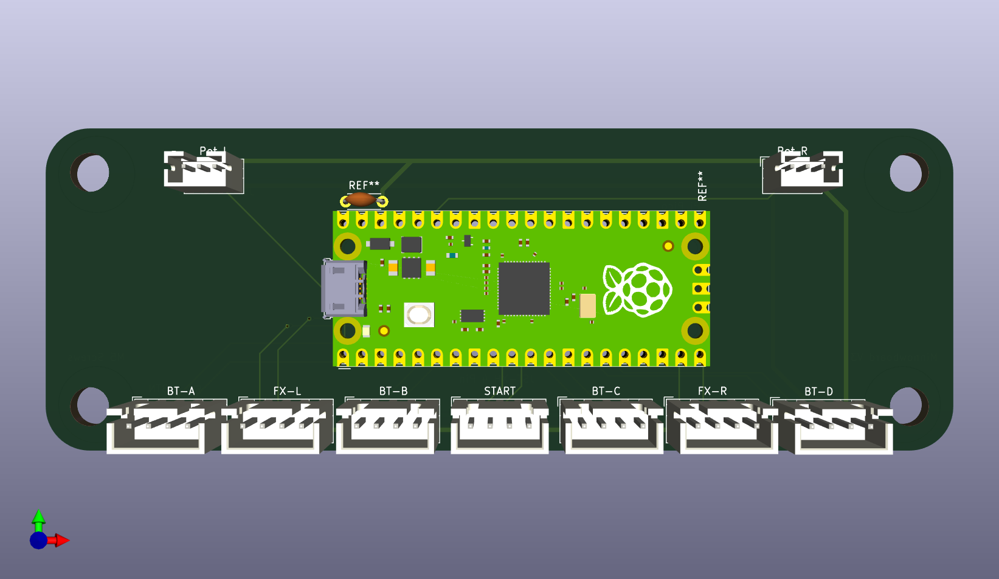
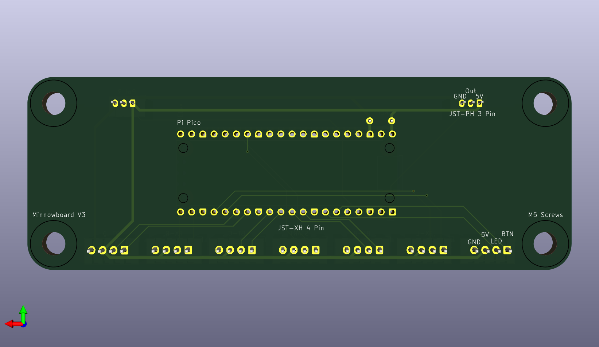

# DJDao PCB Drop-in Replacement

<h1> Caution! This version is not yet complete! </h1>
This project aims to be a drop-in replacement for DJDao SVSE5 and SVRE9 PCBs. Currently only supports potentiometers and DJDao-style wiring.

<h1>Current version: 3.0</h1>

# Pin assignments

| Button | Data | LED |
| ------ | ---- | --- |
| BT-A   | 4    | 5   |
| BT-B   | 6    | 7   |
| BT-C   | 8    | 9   |
| BT-D   | 10   | 11  |
| FX-L   | 12   | 13  |
| FX-R   | 14   | 15  |
| Start  | 20   | 21  |
| VOL-L  | 0    | N/A |
| VOL-R  | 2    | N/A |

# Code

Use a modifed version of [SpeedyPotato's code](https://github.com/speedypotato/Pico-Game-Controller/).

# Known Issues

__V1__
- Pots are jittery, affected by the LEDs, and each other(?)
- Button pins have swapped GND and 5V

__V2__
- Pots are a bit jittery.
- Pro Micro footprint is actually a Teensy 2.0 footprint. This is only a cosmetic difference.
- Pro Micro USB-C slot is blocked by the Start button, requiring it to be mounted upside-down
- Upside-down mounting might require extension cables for each button

__V3.0__
- Can only supply 3.3V to LEDs. 5V support to be added later
- Untested. 

# ToDO

- Add quadrature encoder support
- Add firmware code
- Figure out how to drive 5V LEDs
- LED strip support