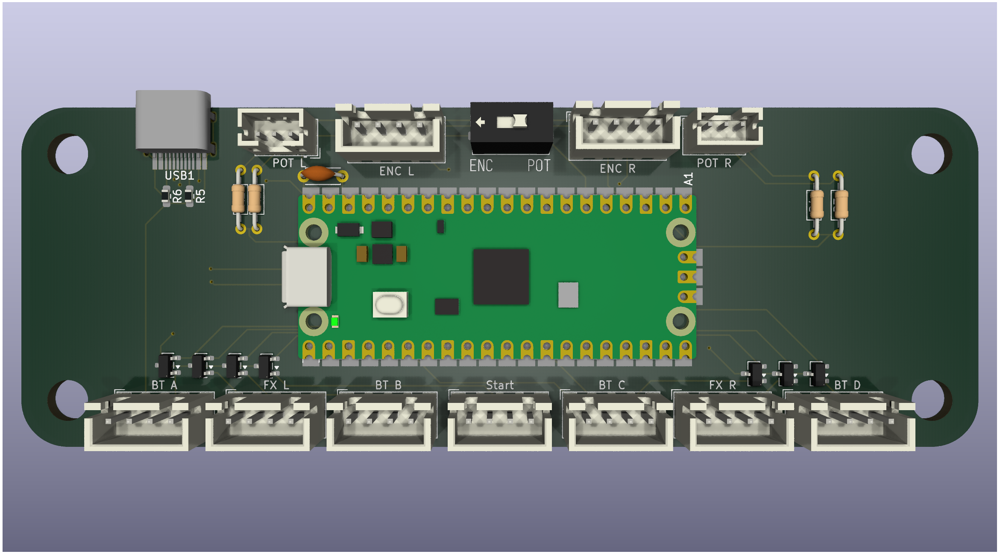
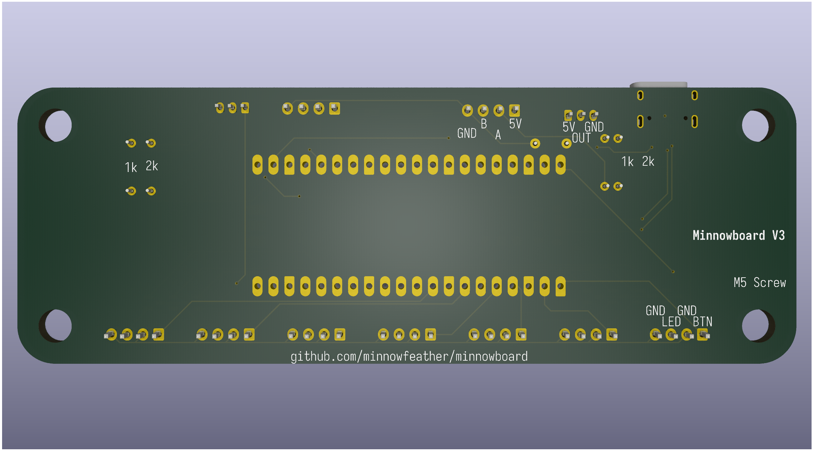

# DJDao PCB Drop-in Replacement

| Version  |                    Front                    |                   Back                    |
| :------: | :-----------------------------------------: | :---------------------------------------: |
|   Pico   |  |  |
| Leonardo |                     WIP                     |                    WIP                    |

This project aims to be a drop-in replacement for DJDao SVSE5 and SVRE9 PCBs. Currently only supports potentiometers and DJDao-style wiring.

# Pin assignments

 Pi Pico 

### Button assignments

| Button | Data | LED |
| ------ | ---- | --- |
| BT-A   | 0    | 10  |
| BT-B   | 2    | 8   |
| BT-C   | 4    | 13  |
| BT-D   | 6    | 11  |
| FX-L   | 1    | 9   |
| FX-R   | 14   | 12  |
| Start  | 3    | 7   |

### Knob assignments

| Knob  | Pot | Enc A | Enc B |
| ----- | --- | ----- | ----- |
| VOL-L | 16  | 16    | 17    |
| VOL-R | 17  | 18    | 19    |

Flick the switch (pin 20) to toggle between Potentiometer and Encoder mode.

# Code

In progress

# Known Issues

**Leonardo V1**

- Pots are jittery, affected by the LEDs, and each other(?)
- Button pins have swapped GND and 5V

**Leonardo V2**

- Pots are a bit jittery.
- Pro Micro footprint is actually a Teensy 2.0 footprint. This is only a cosmetic difference.
- Pro Micro USB-C slot is blocked by the Start button, requiring it to be mounted upside-down
- Upside-down mounting might require extension cables for each button

**Pi Pico V1**

- Possible stability issues with potentiometers
- Untested asf
- Transistor too close to button? Possible melting?

# ToDO

- Add firmware code
- Merge leonardo/pi pico
